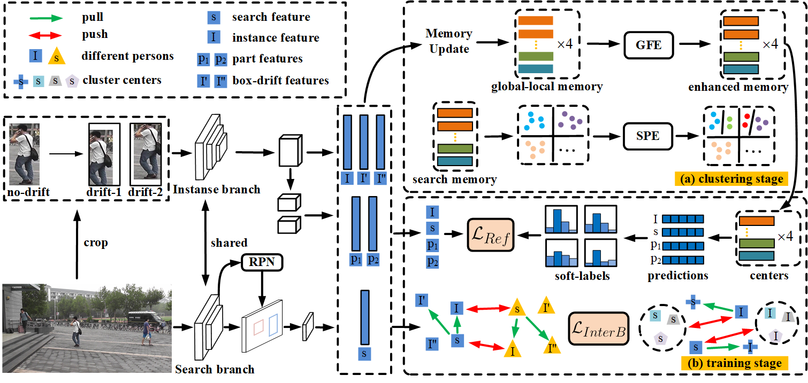

## Introduction

This is the implementation testing codes for A Multi-Granularity Scene-Aware Graph Convolutional Method for Weakly Supervised Person Search


Overall pipeline of the proposed multi-granularity scene-aware graph convolutional method framework for weakly supervised one-step person search. 

## Installation

The project is based on [MMdetection](https://github.com/open-mmlab/mmdetection), please refer to [install.md](docs/install.md) to install MMdetection.

We utilized cuda=11.3, pytorch=1.10.1, mmcv=1.2.6, mmdet=2.4.0

    conda create -n dicl python=3.7 -y
    conda activate dicl
    conda install pytorch torchvision torchaudio cudatoolkit=11.1 -c pytorch-lts -c nvidia
    cd mmcv
    MMCV_WITH_OPS=1 pip install -e .
    cd ..
    pip install -r requirements/build.txt
    pip install -v -e .
    conda install -c conda-forge faiss=*=*_cuda
    pip install  mmpycocotools

## Dataset

Download [CUHK-SYSU](https://github.com/ShuangLI59/person_search) and [PRW](https://github.com/liangzheng06/PRW-baseline).

We provide coco-style annotation in [demo/anno](demo/anno).

For CUHK-SYSU, change the path of your dataset and the annotaion file in the [config file](configs/_base_/datasets/coco_reid_unsup.py) L2, L35, L40, L46, L51

For PRW, change the path of your dataset and the annotaion file in the [config file](configs/_base_/datasets/coco_reid_unsup_prw.py) L2, L35, L40, L46, L51

## Experiments
  1. Test PRW
Download trained PRW [checkpoint](https://pan.baidu.com/s/193demq1Xwdny-XhD4ulNrg?pwd=ajra). 
   Change the paths in L125 in [test_results_prw.py](tools/test_results_prw.py)
   ```bash
   cd jobs/prw
   sh test.sh
   ```
  2. Test CUHK-SYSU
Download trained CUHK [checkpoint](https://pan.baidu.com/s/1QpqcqWI6iUlQ_iwfZdLs8A?pwd=8kpk). [loub]
   ```bash
   cd jobs/cuhk/
   sh test.sh
   ```
   

## Performance

|Dataset|Model|mAP|Rank1| Config | Link |
|-----|-----|------|-----|------|-----|
|PRW|DICL|41.8%|84.1%|[cfg](configs/dicl/prw_dicl.py)| [model](https://pan.baidu.com/s/193demq1Xwdny-XhD4ulNrg?pwd=ajra)| 
|CUHK-SYSU|DICL| 88.8%|90.5%|[cfg](configs/dicl/cuhk_dicl.py)| [model](https://pan.baidu.com/s/1QpqcqWI6iUlQ_iwfZdLs8A?pwd=8kpk)| 


## Reference Codes
Thanks for the great projects of [CGPS](https://github.com/ljpadam/CGPS), [MMdetection](https://github.com/open-mmlab/mmdetection), [DICL](https://github.com/jiabeiwangTJU/DICL?tab=readme-ov-file).

<!-- ## License -->
<!-- This project is released under the [Apache 2.0 license](LICENSE). -->
